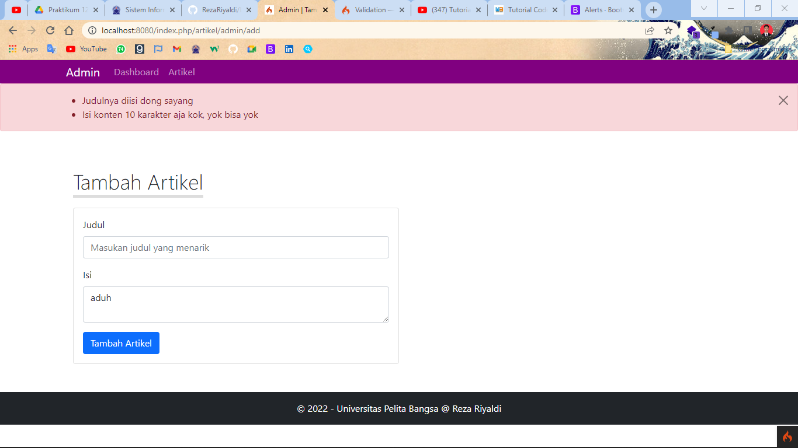
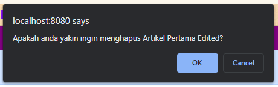
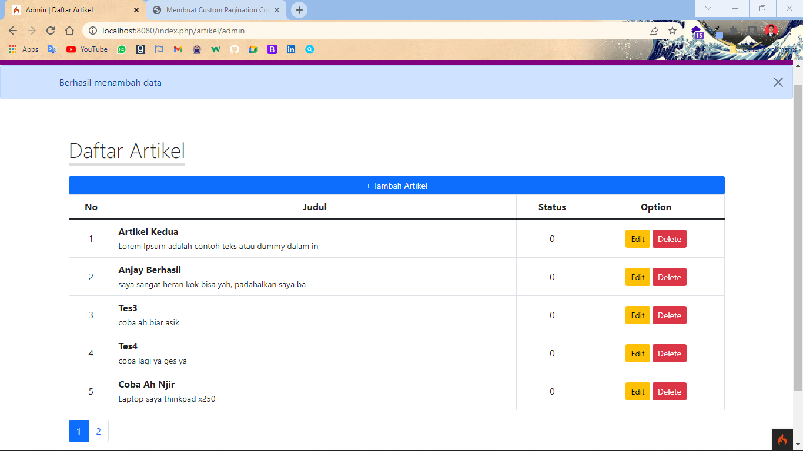

# Tugas Lab 11 Web (Praktikum 11)
## Profil
| # | Biodata |
| -------- | --- |
| **Nama** | Reza Riyaldi Irawan |
| **NIM** | 312010284 |
| **Kelas** | TI.20.A.2 |
| **Mata Kuliah** | Pemrograman Web |

## Langkah 1 `Installasi`
1. Pergi ke `C:/xampp/php/` dan buka file `php.ini`.
2. Aktifkan beberapa ekstensi seperti berikut.


3. Install Codeigniter 4 melalui composer di terminal dengan mengetikan perintah.

```
composer create-project codeigniter4/appstarter ci4
```

4. Kemudian ubah file `env` menjadi `.env`, lalu ubah seperti berikut.


5. Jalankan projek dengan klik [http://localhost/lab11_php_ci/ci4/public](http://localhost/lab11_php_ci/ci4/public)


   
6. Atau menggunakan `php spark` diterminal, dengan mengetikan.

```
php spark serve
```
7. Hasilnya akan seperti berikut.


8. Buka [http://localhost:8080](http://localhost:8080), maka hasilnya akan seperti berikut.


Maka instalasi telah berhasil.

## Langkah 1 `Membuat Route Baru`
1. Tambahkan kode berikut pada `Routes.php` di `app/Config/`.

```php
$routes->get('/about', 'Page::about');
$routes->get('/contact', 'Page::contact');
$routes->get('/faqs', 'Page::faqs');
```

2. Untuk mengetahui route sudah benar atau belum buka cli, lalu ketik

```
php spark routes
```

3. Maka hasilnya akan seperti berikut.


4. Lalu kita dapat mengakses routes tersebut dibrowser, misalnya [http://localhost:8080/faqs](http://localhost:8080/faqs).

5. Maka hasilnya akan seperti berikut.


## Langkah 2 `Membuat Controller`
Contoh diatas menghasil `404 - Not Found` dikarenakan route tersebut mengarah ke _controller_ `Page` dengan method `faqs`, namun tidak ada. Selanjut kita akan membuat satu *Controller*.

1. Buat file baru dengan nama `Page.php` didalam `app/Controller/`.
2. Tambahkan kode berikut.

```php
<?php

namespace App\Controllers;

class Page extends BaseController
{
    public function about()
    {
        echo "Ini halaman About";
    }

    public function contact()
    {
        echo "Ini halaman Contact";
    }

    public function faqs()
    {
        echo "Ini halaman Faqs";
    }

}
```
3. Maka hasilnya akan seperti berikut.


## Langkah 3 `Membuat View`
1. Buat file baru dengan nama `about.php` didalam `app/views/`.
2. Tambahkan kode berikut.

```php
<!DOCTYPE html>
<html lang="en">
<head>
    <meta charset="UTF-8">
    <meta http-equiv="X-UA-Compatible" content="IE=edge">
    <meta name="viewport" content="width=device-width, initial-scale=1.0">
    <title><?= $title ?></title>
</head>
<body>
    <h1><?= $title ?></h1>
    <hr>
    <p><?= $content ?></p>
</body>
</html>
```

3. Kemudian pada *Controller* Page, ubah method `about` menjadi seperti berikut.

```php
public function about()
{
    $data = [
        'title' => "Halaman About",
        'content' => "Selamat datang dihalaman about"
    ];

    return view('about', $data);
}
```

4. Maka hasilnya seperti berikut.


## Langkah 4 `Menambahkan assets`
1. Buat folder didalam direktori public dengan nama `css` dan `js`.
2. Kemudian tambahkan file style kedalam folder tersebut.
3. Lalu hubungkan dengan kode berikut.

```php
<head>
    ...
    <link rel="stylesheet" href="<?= base_url('css/bootstrap.min.css') ?>">
</head>
<body>
    ...
    <script src="<?= base_url('js/bootstrap.min.js') ?>"></script>
</body>
```
4. Maka hasilnya akan seperti berikut.


## Langkah 5 `Templating`
1. Buat folder dengan nama `template` di direktori `Views`.
2. Didalam folder `template` buat file dengan nama `_header.php` dan `_footer.php`.
3. Pada `_header.php` isi dengan kode berikut.

```php
<?php

use CodeIgniter\Config\Services;

$request = Services::request();
?>

<!doctype html>
<html lang="en">

<head>
    <!-- Required meta tags -->
    <meta charset="utf-8">
    <meta name="viewport" content="width=device-width, initial-scale=1">

    <!-- Bootstrap CSS -->
    <link rel="stylesheet" href="<?= base_url('css/bootstrap.min.css') ?>">

    <!-- My CSS -->
    <link rel="stylesheet" href="<?= base_url('css/style.css') ?>">

    <title>CI4 | <?= $title ?></title>
</head>

<body>
    <div class="container shadow p-0">
        <div class="judul p-3">
            <h2 style="color: rgb(206, 206, 206);">Layout Sederhana</h2>
        </div>

        <nav class="navbar navbar-expand-lg navbar-dark p-0" style="background-color: purple;">
            <div class="container p-0">
                <button class="navbar-toggler ms-auto m-1" type="button" data-bs-toggle="collapse" data-bs-target="#navbarNav" aria-controls="navbarNav" aria-expanded="false" aria-label="Toggle navigation">
                    <span class="navbar-toggler-icon"></span>
                </button>
                <div class="collapse navbar-collapse" id="navbarNav">
                    <ul class="navbar-nav">
                        <li class="nav-item">
                            <a class="nav-link <?= $request->uri->getSegment(1) == '' ? 'active' : '' ?>" href="<?= base_url() ?>">Home</a>
                        </li>
                        <li class="nav-item">
                            <a class="nav-link <?= $request->uri->getSegment(1) == 'article' ? 'active' : '' ?>" href="<?= base_url('article') ?>">Artikel</a>
                        </li>
                        <li class="nav-item">
                            <a class="nav-link <?= $request->uri->getSegment(1) == 'about' ? 'active' : '' ?>" href="<?= base_url('about') ?>">About</a>
                        </li>
                        <li class="nav-item">
                            <a class="nav-link <?= $request->uri->getSegment(1) == 'contact' ? 'active' : '' ?>" href="<?= base_url('contact') ?>">Kontak</a>
                        </li>
                    </ul>
                </div>
            </div>
        </nav>


        <div class="row m-0 my-4">
            <div class="col-md-9">
                <div class="banner py-5 text-center">
```

4. Pada `_footer.php` tambahkan kode berikut.

```html
</div>

</div>
<div class="col-md-3">
    <!-- Widget 1 -->
    <div class="card border-0 mb-3">
        <div class="card-header text-center fw-bolder" style="background-color: purple; color: white;">
            Widget Header
        </div>
        <ul class="list-group list-group-flush" style="border: 1px solid purple;">
            <li class="list-group-item">Widget Link</li>
            <li class="list-group-item">Widget Link</li>
            <li class="list-group-item">Widget Link</li>
            <li class="list-group-item">Widget Link</li>
        </ul>
    </div>

    <!-- Widget 2 -->
    <div class="card border-0">
        <div class="card-header text-center fw-bolder" style="background-color: purple; color: white;">
            Widget Text
        </div>
        <ul class="list-group list-group-flush" style="border: 1px solid purple;">
            <li class="list-group-item">
                Lorem ipsum dolor sit amet consectetur adipisicing elit. Qui neque, architecto aliquam atque
            </li>
        </ul>
    </div>
</div>
</div>


<footer class="bg-dark text-white p-3 text-center">
    <p class="m-0">&copy; 2022 - Universitas Pelita Bangsa @ Reza Riyaldi</p>
</footer>
</div>


<script src="js/bootstrap.min.js"></script>
</body>

</html>
```

5. Pada file `about.php` ubah kodenya menjadi berikut.

```php
<?= $this->include('template/_header'); ?>

<h1 class="fw-light"><?= $title ?></h1>
" alt="" class="rounded-circle border border-5 border-primary mb-2" width="150px">
<p><?= $content ?></p>
<a href="#" class="btn" style="background-color: purple; color: white;">Learn More</a>

<?= $this->include('template/_footer'); ?>
```

6. Pada file `style.css` menjadi berikut.

```css
html, body {
    height: 100vh;
    display: flex;
    justify-content: center;
    align-items: center;
}

/* Navigasi */
ul li a {
    padding: 10px 20px !important;
}

a.active, a.nav-link:hover {
    background-color: #fa11c0;
}


/* Banner */
.banner {
    padding-left: 20px;
    padding-right: 20px;
    background-color: rgb(245, 245, 245);
}

.banner h1 {
    font-size: 50px;
}
```

7. Maka hasilnya akan seperti berikut.


## Pertanyaan dan Tugas
Lengkapi kode program untuk menu lainnya yang ada pada Controller Page, sehingga
semua link pada navigasi header dapat menampilkan tampilan dengan layout yang
sama.

1. Buat 3 file di dalam direktori `Views` dengan nama:
   + home.php
   + article.php
   + contact.php
2. Ubah `Routes` untuk url root mengarah ke controller `Page`, seperti berikut.
```php
// $routes->get('/', 'Home::index'); Sebelum
$routes->get('/', 'Page::index'); // Sesudah
```
3. `home.php`.
+ Views

```php
<?= $this->include('template/_header'); ?>

<h1 class="fw-light"><?= $title ?></h1>
<p><?= $content ?></p>

<?= $this->include('template/_footer'); ?>
```

+ Controller method `index()`.

```php
public function index()
{
    $data = [
        'title' => 'Home',
        'content' => 'Selamat datang di halaman Home'
    ];

    return view('home', $data);
}
```

+ Maka hasilnya akan seperti berikut.


4. `article.php`.
+ Views
```php
<?= $this->include('template/_header'); ?>

<h1 class="fw-light"><?= $title ?></h1>
<p><?= $content ?></p>

<?= $this->include('template/_footer'); ?>
```

+ Controller method `article()`
```php
public function article()
{
    $data = [
        'title' => 'Article',
        'content' => 'Ini adalah halaman article, banyak hal yang bisa diambil dan dipelajari didalam halaman ini. Enjoy'
    ];

    return view('article', $data);
}
```

+ Maka hasilnya akan seperti berikut.


5. `contact.php`
+ Views

```php
<?= $this->include('template/_header'); ?>

<h1 class="fw-light"><?= $title ?></h1>

<form action="" class="text-start">
    <div class="mb-2">
        <label for="" class="form-label">Email</label>
        <input type="email" class="form-control">
    </div>

    <div class="mb-2">
        <label for="" class="form-label">Subject</label>
        <input type="text" class="form-control">
    </div>

    <div class="mb-2">
        <label for="" class="form-label">Message</label>
        <textarea name="" class="form-control" id="" cols="10" rows="3"></textarea>
    </div>

    <button class="btn btn-primary">Send</button>
</form>

<?= $this->include('template/_footer'); ?>
```

+ Controller pada method `contact()`

```php
public function contact()
{
    $data = [
        'title' => "Contact"
    ];
    return view('contact', $data);
}
```

+ Maka hasilnya akan seperti berikut.


# Tugas Lab 11 Web (Praktikum 12 `CRUD`)
## Langkah 1 `Membuat DB`
1. Buat database baru dengan nama `lab_ci4` dengan query berikut.

```SQL
CREATE DATABASE lab_ci4;
```
2. Membuat Table baru dengan nama `artikel` dengan query berikut.

```SQL
CREATE TABLE artikel {
    id INT(11) auto_increment,
    judul VARCHAR(200) NOT NULL,
    isi TEXT,
    gambar VARCHAR(200),
    status TINYINT(1) DEFAULT 0,
    slug VARCHAR(200),
    PRIMARY KEY(id)
}
```
## Langkah 2 `Konfigurasi koneksi database`
1. Buka file `.env`, lalu edit seperti berikut.


## Langkah 3 `Membuat Model`
1. Buat file baru dengan nama `ArtikelModel.php` pada direktori `app/Models`.
2. Tambahkan kode berikut.

```php
<?php
namespace App\Models;
use CodeIgniter\Model;

class ArtikelModel extends Model {
    protected $table = 'artikel';
    protected $primary = 'id';
    protected $setAutoIncrement = TRUE;
    protected $allowedFields = ['judul', 'isi', 'status', 'slug', 'gambar', 'date_created'];
}
```

## Langkah 4 `Membuat Controller`
1. Buat file baru dengan nama `Artikel.php` pada direktori `app/Controller`.
2. Tambahkan kode berikut.

```php
<?php

namespace App\Controllers;

use App\Models\ArtikelModel;
use CodeIgniter\Controller;
use CodeIgniter\Exceptions\PageNotFoundException;
use CodeIgniter\I18n\Time;

class Artikel extends Controller
{
    protected $artikel;

    public function __construct()
    {
        $this->artikel = new ArtikelModel();
    }

    public function index()
    {
        $title = 'Daftar Artikel';
        $artikels = $this->artikel->findAll();

        return view('artikel/home', compact('title', 'artikels'));
    }
}
```

## Langkah 5 `Membuat View`
1. Buat file baru dengan nama `home.php` pada direktori `app/Views/artikel`.
2. Tambahkan kode berikut.

```php
<?= $this->include('template/_header.php'); ?>

<h1 class="display-4">Artikel</h1>

<?php if ($artikels) : foreach ($artikels as $artikel) : ?>
        <div class="card">
            <div class="card-header">
                <h2><a href="<?= base_url('artikel/') . $artikel['slug'] ?>"><?= $artikel['judul'] ?></a></h2>
            </div>

            <div class="card-body">
                <p><?= substr($artikel['isi'], 0, 200) ?></p>
            </div>
        </div>
    <?php endforeach;
else : ?>
<div class="card">
    <div class="card-body">Belum ada data</div>
</div>
<?php endif; ?>

<?= $this->include('template/_footer.php'); ?>
```

3. Maka hasilnya akan seperti berikut.


4. Karena datanya belum ada, kita tambah data dengan menjalan query berikut diphpmyadmin.

```SQL
INSERT INTO artikel (judul, isi, slug) VALUE
('Artikel pertama', 'Lorem Ipsum adalah contoh teks atau dummy dalam industri
percetakan dan penataan huruf atau typesetting. Lorem Ipsum telah menjadi
standar contoh teks sejak tahun 1500an, saat seorang tukang cetak yang tidak
dikenal mengambil sebuah kumpulan teks dan mengacaknya untuk menjadi sebuah
buku contoh huruf.', 'artikel-pertama'),
('Artikel kedua', 'Tidak seperti anggapan banyak orang, Lorem Ipsum bukanlah
teks-teks yang diacak. Ia berakar dari sebuah naskah sastra latin klasik dari
era 45 sebelum masehi, hingga bisa dipastikan usianya telah mencapai lebih
dari 2000 tahun.', 'artikel-kedua');
```

5. Maka hasilnya seperti berikut.


## Langkah 6 `Detail View`
1. Tambahkan method baru dengan nama `detail_artikel($slug)` pada Controller `Artikel.php`.
2. Maka kodenya seperti berikut.

```php
public function detail_artikel($slug)
{
    $artikel = $this->artikel->where([
        'slug' => $slug
    ])->first();

    if (!$artikel) {
        throw PageNotFoundException::forPageNotFound();
    }
    $title = $artikel['judul'];

    return view('artikel/detail_artikel', compact('title', 'artikel'));
}
```

3. Tambahkan Routes baru dengan kode seperti berikut.

```php
$routes->get('/artikel/(:any)', 'Artikel::detail_artikel/$1');
```

4. Buat file baru dengan nama `detail_artikel.php` didalam direktori `app/Views/artikel`.
5. Tambahkan kode berikut.

```php
<?= $this->include('template/_header.php'); ?>

<h1 class="display-4" style="font-size: 36px;">Detail <?= $artikel['judul'] ?></h1>

<div class="card my-3">
    <div class="card-header">
        <h4><?= $artikel['judul'] ?></h4>
    </div>

    <div class="card-body">
        <!-- " alt="<?= $artikel['judul'] ?>"> -->
        <p><?= $artikel['isi'] ?></p>
    </div>

    <div class="card-footer text-center">
        <?= $artikel['date_created'] ?>
    </div>
</div>

<?= $this->include('template/_footer.php'); ?>
```

6. Maka hasilnya sebagai berikut.


## Langkah 7 `Membuat Menu Admin`
1. Buat method baru dengan nama `admin()` didalam Controller `Artikel`.
2. Tambahkan kode berikut.

```php
public function admin()
{
    $title = 'Daftar Artikel';
    $artikel = $this->artikel->findAll();

    return view('artikel/admin', compact('title', 'artikel'));
}
```
3. Tambahkan route baru seperti berikut.

```php
$routes->group('artikel/admin', function($routes) {
    $routes->get('/', 'Artikel::admin');

    // Add
    $routes->get('add', 'Artikel::add_artikel');
    $routes->add('store', 'Artikel::store');

    // Edit
    $routes->get('edit/(:any)', 'Artikel::edit/$1');
    $routes->add('update/(:any)', 'Artikel::update/$1');

    // Delete
    $routes->get('delete/(:any)', 'Artikel::delete/$1');
});
```

4. Buat 2 file template dengan nama `admin_header.php` dan `admin_footer.php` didalam direktor `app/Views/template`

```php
// admin_header.php
<?php

use CodeIgniter\Config\Services;

$request = Services::request();
?>

<!doctype html>
<html lang="en">

<head>
    <!-- Required meta tags -->
    <meta charset="utf-8">
    <meta name="viewport" content="width=device-width, initial-scale=1">

    <!-- Bootstrap CSS -->
    <link rel="stylesheet" href="<?= base_url('css/bootstrap.min.css') ?>">

    <!-- My CSS -->
    <!-- <link rel="stylesheet" href="<?= base_url('css/style_admin.css') ?>"> -->

    <title>Admin | <?= $title ?></title>
</head>

<body>
    <?php
    if (!isset($auth) || !$auth) {
    ?>
        <nav class="navbar navbar-expand-lg navbar-dark p-0" style="background-color: purple;">
            <div class="container p-0">
                <a class="navbar-brand" href="<?= base_url('artikel/admin') ?>">Admin</a>
                <button class="navbar-toggler ms-auto m-1" type="button" data-bs-toggle="collapse" data-bs-target="#navbarNav" aria-controls="navbarNav" aria-expanded="false" aria-label="Toggle navigation">
                    <span class="navbar-toggler-icon"></span>
                </button>
                <div class="collapse navbar-collapse" id="navbarNav">
                    <ul class="navbar-nav">
                        <li class="nav-item">
                            <a class="nav-link <?= $request->uri->getSegment(3) == '' ? 'active' : '' ?>" href="<?= base_url('artikel/admin') ?>">Artikel</a>
                        </li>
                        <li class="nav-item">
                            <a class="nav-link disabled <?= $request->uri->getSegment(3) == 'admin' ? 'active' : '' ?>" href="<?= base_url('artikel/admin') ?>">Admin</a>
                        </li>

                        <li class="nav-item">
                            <a class="nav-link disabled <?= $request->uri->getSegment(3) == 'artikel' ? 'active' : '' ?>" href="<?= base_url('artikel/admin/user') ?>">User</a>
                        </li>
                    </ul>
                </div>
                <?php
                if (session()->get('username') != NULL) {
                ?>
                    <div class="collapse navbar-collapse" id="navbarNav">
                        <ul class="navbar-nav ms-auto">
                            <li class="nav-item dropdown">
                                <a class="nav-link dropdown-toggle active" href="#" id="navbarDropdownMenuLink" role="button" data-bs-toggle="dropdown" aria-expanded="false">
                                    Hello, <?= session()->get('username') ?>
                                </a>
                                <ul class="dropdown-menu" aria-labelledby="navbarDropdownMenuLink">
                                    <li><a class="dropdown-item" href="#">Logout</a></li>
                                </ul>
                            </li>
                        </ul>
                    </div>
                <?php } ?>
            </div>
        </nav>

    <?php
    }
    if (session()->getFlashdata('errors')) {
    ?>
        <div class="alert alert-danger alert-dismissible fade show" role="alert">
            <div class="container">
                <?= session()->getFlashdata('errors') ?>
                <button type="button" class="btn-close" data-bs-dismiss="alert" aria-label="Close"></button>
            </div>
        </div>
    <?php
    } else if (session()->getFlashdata('success')) {
    ?>
        <div class="alert alert-primary alert-dismissible fade show" role="alert">
            <div class="container">
                <?= session()->getFlashdata('success') ?>
                <button type="button" class="btn-close" data-bs-dismiss="alert" aria-label="Close"></button>
            </div>
        </div>
    <?php } ?>
```

```php
// admin_footer.php
<?php
if (!isset($auth) || !$auth) {
?>
    <footer class="bg-dark text-white p-3 text-center">
        <p class="m-0">&copy; 2022 - Universitas Pelita Bangsa @ Reza Riyaldi</p>
    </footer>
<?php
}
?>


<script src="<?= base_url('js/bootstrap.min.js') ?>"></script>
</body>

</html>
```

5. Buat file baru dengan nama `admin.php` didalam direktori `app/Views/artikel`, dan tambahkan kode berikut.

```php
<?= $this->include('template/admin_header.php'); ?>

<div class="container py-5">
    <h1 class="display-4 d-inline" style="font-size: 36px; border-bottom: 5px solid #ddd;"><?= $title ?></h1>

    <a href="<?= base_url('artikel/admin/add') ?>" class="btn btn-primary btn-sm d-block mt-4">+ Tambah Artikel</a>
    <table class="table table-hover table-bordered">
        <thead>
            <tr class="text-center">
                <th>No</th>
                <th>Judul</th>
                <th>Status</th>
                <th>Option</th>
            </tr>
        </thead>

        <tbody>
            <?php
            $no = 1;
            if ($artikels) {
                foreach ($artikels as $artikel) { ?>
                    <tr>
                        <td class="text-center" style="vertical-align: middle;"><?= $no++ ?></td>
                        <td>
                            <b class="d-block"><?= $artikel['judul'] ?></b>
                            <small><?= substr($artikel['isi'], 0, 50) ?></small>
                        </td>
                        <td class="text-center" style="vertical-align: middle;"><?= $artikel['status'] ?></td>
                        <td class="text-center" style="vertical-align: middle;">
                            <a href="<?= base_url() . '/artikel/edit/' . $artikel['slug'] ?>" class="btn btn-warning btn-sm">Edit</a>
                            <a href="<?= base_url() . '/artikel/delete/' . $artikel['slug'] ?>" class="btn btn-danger btn-sm" onclick="return confirm('Apakah anda yakin ingin menghapus <?= $artikel['judul'] ?>?')">Delete</a>
                        </td>
                    </tr>
                <?php }
            } else { ?>
                <tr>
                    <td colspan="4" class="text-center">Data masih kosong</td>
                </tr>
            <?php } ?>
        </tbody>

        <!-- <tfoot>
            <tr>
                <th>No</th>
                <th>Judul</th>
                <th>Status</th>
                <th>Option</th>
            </tr>
        </tfoot> -->
    </table>
</div>

<?= $this->include('template/admin_footer.php'); ?>
```

6. maka hasilnya seperti berikut.


## Langkah 8 `Add Artikel`
1. Buat 2 method baru dengan nama `add_artikel()`, `store()` didalam Controller `Artikel`.
2. Tambahkan kode berikut.

```php
public function add_artikel()
{

    $title = 'Tambah Artikel';
    return view('artikel/tambah_artikel', compact('title'));
}

public function store()
{
    if (!$this->validate([
        'judul' => [
            'rules' => 'required',
            'errors' => [
                'required' => 'Judulnya diisi dong sayang'
            ],
        ],
        'isi' => [
            'rules' => 'min_length[10]',
            'errors' => [
                'min_length' => 'Minimal 10 karakter aja kok, yok bisa yok'
            ]
        ]
    ])) {
        session()->setFlashdata('errors', $this->validator->listErrors());
        redirect()->back()->withInput();
    }

    // var_dump($this->request->getPost()); die();

    $this->artikel->insert([
        'judul' => ucwords(strtolower($this->request->getPost('judul'))),
        'isi' => $this->request->getPost('isi'),
        'slug' => url_title(strtolower($this->request->getPost('judul'))),
        'date_created' => Time::now()
    ]);

    session()->setFlashdata('success', 'Berhasil menambah data');
    return redirect()->to('artikel/admin');
}
```

3. Buat file baru dengan nama `tambah_artikel.php` didalam direktri `app/Views/artikel`, lalu tambahkan kode berikut.

```php
<?= $this->include('template/admin_header'); ?>

<div class="container py-5">
    <h1 class="display-4 d-inline" style="font-size: 36px; border-bottom: 5px solid #ddd;">Tambah Artikel</h1>

    <div class="row m-0 mt-4">
        <div class="col-md-6 p-0">
            <div class="card">
                <div class="card-body">
                    <form action="<?= base_url('artikel/admin/store') ?>" method="post">
                        <div class="mb-3">
                            <label for="" class="form-label">Judul</label>
                            <input type="text" class="form-control" name="judul" placeholder="Masukan judul yang menarik" value="<?= old('judul') ?>">
                        </div>

                        <div class="mb-3">
                            <label for="" class="form-label">Isi</label>
                            <textarea name="isi" id="" cols="" rows="" placeholder="Buatlah artikel yang menarik" class="form-control"><?= old('isi') ?></textarea>
                        </div>

                        <button type="submit" class="btn btn-primary">Tambah Artikel</button>
                    </form>
                </div>
            </div>
        </div>
    </div>
</div>

<?= $this->include('template/admin_footer'); ?>
```

4. Maka hasilnya sebagai berikut.


5. Apabila ada kesalahan.
   


6. Apabila berhasil.


## Langkah 9 `Update Artikel`
1. Buat 2 method baru dengan nama `edit(slug)` dan `update($id)` didalam Controller `Artikel`, tambahkan kode berikut.

```php
public function edit($slug)
{
    $data =[
        'title' => 'Edit Artikel',
        'artikel' => $this->artikel->where('slug', $slug)->first()
    ];

    return view('artikel/edit_artikel', $data);
}

public function update($id)
{
    if (!$this->validate([
        'judul' => [
            'rules' => 'required',
            'errors' => [
                'required' => 'Judulnya diisi dong sayang'
            ],
        ],
        'isi' => [
            'rules' => 'min_length[10]',
            'errors' => [
                'min_length' => 'Isi konten 10 karakter aja kok, yok bisa yok'
            ]
        ]
    ])) {
        session()->setFlashdata('errors', $this->validator->listErrors());
        return redirect()->back();
    }

    $this->artikel->update($id, [
        'judul' => ucwords(strtolower($this->request->getPost('judul'))),
        'isi' => $this->request->getPost('isi'),
        'slug' => url_title(strtolower($this->request->getPost('judul')))
    ]);

    session()->setFlashdata('success', 'Berhasil mengubah data');
    return redirect()->to('artikel/admin');
}
```

2. Tambahkan file baru dengan nama `edit_artikel.php` didalam direktori `app/Views/artikel`, lalu tambahkan kode berikut.

```php
<?= $this->include('template/admin_header'); ?>

<div class="container py-5">
    <h1 class="display-4 d-inline" style="font-size: 36px; border-bottom: 5px solid #ddd;">Edit Artikel</h1>

    <div class="row m-0 mt-4">
        <div class="col-md-6 p-0">
            <div class="card">
                <div class="card-body">
                    <form action="<?= base_url(). '/artikel/admin/update/' . $artikel['id'] ?> " method="post">
                        <div class="mb-3">
                            <label for="" class="form-label">Judul</label>
                            <input type="text" class="form-control" name="judul" placeholder="Masukan judul yang menarik" value="<?= $artikel['judul'] ?>">
                        </div>

                        <div class="mb-3">
                            <label for="" class="form-label">Isi</label>
                            <textarea name="isi" id="" cols="" rows="" placeholder="Buatlah artikel yang menarik" class="form-control"><?= $artikel['isi'] ?></textarea>
                        </div>

                        <button type="submit" class="btn btn-primary">Edit Artikel</button>
                    </form>
                </div>
            </div>
        </div>
    </div>
</div>

<?= $this->include('template/admin_footer'); ?>
```

3. Maka hasilnya akan seperti berikut.


4. Apabila berhasil maka hasilnya seperti berikut.


## Langkah 10 `Delete Artikel`
1. Tambahkan method baru dengan nama `delete($slug)` didalam Controller `Artikel`, lalu tambahkan kode berikut.

```php
public function delete($slug)
{
    if($this->artikel->where('slug', $slug)->first() === NULL) {
        throw PageNotFoundException::forPageNotFound('Data tidak ditemukan!');
    }

    $this->artikel->where('slug', $slug)->delete();

    session()->setFlashdata('success', 'Berhasil hapus data');
    return redirect('artikel/admin');
}
```

2. Maka ketika tombol delete diklik, akan seperti berikut.



3. Apabila yes akan seperti berikut.


# Tugas Lab 11 Web (Praktikum 13 `Module Login`)
## Langkah 1 `Membuat Table`
1. Buat table dengan menggunakan query berikut.

```sql
CREATE TABLE user (
    id INT(11) auto_increment,
    username VARCHAR(200) NOT NULL,
    useremail VARCHAR(200),
    userpassword VARCHAR(200),
    PRIMARY KEY(id)
);
```

2. Buat Model baru dengan nama `UserModel.php` didalam direktori `/app/Models`. Lalu tambahkan kode berikut.

```php
<?php

use CodeIgniter\Model;

class UserModel extends Model {
    protected $table = 'user';
    protected $primaryKey = 'id';
    protected $useAutoIncrement = TRUE;
    protected $allowedFields = ['username', 'useremail', 'userpassword'];
}
```
3. Buat Controller baru dengan nama `User.php` didalam direktori `app/Controllers`. Laliu tambahkan kode berikut.

```php
<?php

use App\Controllers\BaseController;

class User extends BaseController
{
    private $user;

    public function __construct()
    {
        $user = new UserModel();
        helper('form');
    }

    public function index()
    {
        $data = [
            'title' => 'Daftar User',
            'users' => $this->user->findAll()
        ];

        return view('user/index', $data);
    }

    public function login()
    {
        $input = (object) $this->request->getPost();
        $message = "";
        $type_message = "errors";

        if (!$input->email) {
            $data = [
                'title' => 'Login',
                'auth' => TRUE
            ];
            return view('user/login', $data);
        }
        $login = $this->user->where('useremail', $input->email)->first();
        if ($login) {
            $pass = $login['userpassword'];
            if (password_verify($input->password, $pass)) {
                $login_data = [
                    'user_id' => $login['id'],
                    'username' => $login['username'],
                    'password' => $login['password'],
                    'logged_id' => TRUE
                ];

                session()->set($login_data);
                $type_message = "success";
                $message = "Login berhasil, selamat datang " . $login['username'];
            } else {
                $message = "Password salah!";
            }
        } else {
            $message = "User tidak ditemukan!";
        }

        session()->setFlashdata($type_message, $message);
        if ($type_message != "errors") {
            return redirect('admin/artikel');
        } else {
            return redirect('user/login');
        }
    }
}
```

4. Buat direktori baru dengan `user` didalam direktori `app/Views`.
5. Buat file baru dengan nama `login.php` didalam direktori `app/Views/user`, lalu tambahkan kode berikut.

```php
<?= $this->include('template/admin_header.php'); ?>
<div class="row m-0">
    <div class="col-md-4 mx-auto">
        <div class="card mt-5">
            <div class="card-header">
                <h4>Login</h4>
            </div>

            <div class="card-body">
                <form action="" method="post">
                    <div class="mb-3">
                        <label for="" class="form-label">Email</label>
                        <input type="email" class="form-control" name="email" value="<?= set_value('email') ?>">
                    </div>

                    <div class="mb-3">
                        <label for="" class="form-label">Password</label>
                        <input type="password" class="form-control" name="password" value="<?= set_value('password') ?>">
                    </div>

                    <button type="submit" class="btn btn-primary">Login</button>
                </form>
            </div>
        </div>
    </div>
</div>
<?= $this->include('template/admin_footer.php'); ?>
```

5. Maka hasilnya sebagai berikut.


## Langkah 2 `Membuat Data Dummy`
1. Buka CLI/terminal, dan ketik

```
php spark make:seeder UserSeed
```

2. Buka file `UserSeed.php` didalam direktori `app/Database/Seeds`, lalu tambahkan kode berikut.

```php
<?php

namespace App\Database\Seeds;

use CodeIgniter\Database\Seeder;

class UserSeed extends Seeder
{
    public function run()
    {
        $model = model('UserModel');
        $model->insert([
            'username' => 'admin',
            'useremail' => 'admin@hotmail.com',
            'userpassword' => password_hash('admin', PASSWORD_DEFAULT)
        ]);
    }
}
```
3. Buka kembali CLI/terminal, lalu ketik.

```
php spark db:seed UserSeed
```

4. Lalu coba login menggunakan akun yang sudah ditambahkan didalam seeds.
    + email : admin@hotmail.com
    + password : admin
5. Maka hasilnya sebagai berikut.


6. Namun apabila akun tidak ada maka hasilnya akan sebagai berikut.


## Langkah 3 `Auth Filter`
1. Buat file baru dengan nama `Auth.php` didalam direktori `app/Filters`. Lalu tambahkan kode berikut.

```php
<?php
namespace App\Filters;

use CodeIgniter\Filters\FilterInterface;
use CodeIgniter\HTTP\RequestInterface;
use CodeIgniter\HTTP\ResponseInterface;

class Auth implements FilterInterface {
    public function before(RequestInterface $request, $arguments = NULL)
    {
        if (!session()->get('logged_in')) {
            session()->setFlashdata('errors', "Login dulu bre biar asik");
            return redirect()->to('user/login');
        }
    }

    public function after(RequestInterface $request, ResponseInterface $response, $arguments = NULL)
    {
        // Do something here
    }
}
```

2. Buka file `app\Config\Filters.php`, lalu tambahkan kode berikut.

```php
use App\Filters\Auth;
...

class Filters extends BaseConfig
{
    /**
     * Configures aliases for Filter classes to
     * make reading things nicer and simpler.
     *
     * @var array
     */
    public $aliases = [
        'csrf'          => CSRF::class,
        'toolbar'       => DebugToolbar::class,
        'honeypot'      => Honeypot::class,
        'invalidchars'  => InvalidChars::class,
        'secureheaders' => SecureHeaders::class,

        // Your filter
        'auth'          => Auth::class
    ];
    ...
} 
```

3. Buka file `Routes.php`, lalu ubah kode seperti berikut.

```php
$routes->group('artikel/admin', ['filter' => 'auth'], function($routes) {
    $routes->get('/', 'Artikel::admin');

    // Add
    $routes->get('add', 'Artikel::add_artikel');
    $routes->add('store', 'Artikel::store');

    // Edit
    $routes->get('edit/(:any)', 'Artikel::edit/$1');
    $routes->add('update/(:any)', 'Artikel::update/$1');

    // Delete
    $routes->get('delete/(:any)', 'Artikel::delete/$1');
});
```

4. Maka apabila belum login tapi memaksa masuk akan dilempar kembali, seperti berikut.


## Langkah 4 `Logout`
1. Tambahkan method baru dengan nama `logout()` didalam Controller `User`.
2. Tambahkan kode berikut.

```php
public function logout()
{
    session()->set([
        'logged_in' => FALSE
    ]);
    
    session()->remove([
        'user_id', 'username', 'email', 'password'
    ]);
    session()->setFlashdata('success', "Logout berhasil, semoga harimu senin terus");
    return redirect()->to('user/login');
}
```

3. Maka hasilnya sebagai berikut.


# Tugas Lab 11 Web (Praktikum 14 `Pagination & Pencarian`)
## Langkah 1 `Membuat Pagination`
1. Buka kembali Controller Artikel, lalu modifikasi kode pada method `admin()` seperti berikut.

```php
public function admin()
{
    $artikels = $this->artikel->paginate(5, 'btcorona');
    $data = [
        'title' => 'Daftar Artikel',
        'artikels' => $artikels,
        'pager' => $this->artikel->pager
    ];

    return view('artikel/admin', $data);
}
```

2. Buat file baru bernama `bootstrap.php` didalam `app/Views/Pagers/`, Lalu buat kode seperti berikut.

```php
<?php $pager->setSurroundCount(2) ?>
<nav>
    <ul class="pagination">
        <?php if ($pager->hasPrevious()) { ?>
            <li class="page-item">
                <a href="<?= $pager->getFirst() ?>" aria-label="First" class="page-link">
                    <span aria-hidden="true">First</span>
                </a>
            </li>

            <li class="page-item">
                <a href="<?= $pager->getPrevious() ?>" aria-label="Previous" class="page-link">
                    <span>&laquo;</span>
                </a>
            </li>
        <?php } ?>

        <?php
        foreach ($pager->links() as $link) {
            $activeClass = $link['active'] ? 'active' : '';
        ?>
            <li class="page-item <?= $activeClass ?>">
                <a href="<?= $link['uri'] ?>" class="page-link">
                    <?= $link['title'] ?>
                </a>
            </li>
        <?php } ?>

        <?php if ($pager->hasNext()) { ?>
            <li class="page-item">
                <a href="<?= $pager->getNext() ?>" aria-label="Next" class="page-link">
                    <span aria-hidden="true">&raquo;</span>
                </a>
            </li>
            <li class="page-item">
                <a href="<?= $pager->getLast() ?>" aria-label="Last" class="page-link">
                    <span aria-hidden="true">Last</span>
                </a>
            </li>
        <?php } ?>
    </ul>
</nav>
```

3. Mendaftarkan View ke Config, buka file `app/Config/Pager.php`, lalu tambahkan kode berikut.

```php
public $templates = [
    ...

    // Custom Pagination
    'bootstrap_pagination' => 'App\Views\Pagers\bootstrap'
];
```

4. Buka file `admin.php` lalu tambahkan kode berikut.

```php
<?= $this->include('template/admin_header.php'); ?>

<div class="container py-5">
    ...
    <?= $pager->links('btcorona', 'bootstrap_pagination') ?>
</div>

<?= $this->include('template/admin_footer.php'); ?>
```

5. Maka hasilnya sebagai berikut.



## Langkah 2 `Membuat Search`
1. Buka kembali Controller `Artikel.php`, lalu ubah kode menjadi seperti berikut.

```php
public function admin()
{
    $cari = $this->request->getVar('cari') ?? '';
    $artikels = $this->artikel->like('judul', $cari)->paginate(5, 'btcorona');
    $data = [
        'title' => 'Daftar Artikel',
        'artikels' => $artikels,
        'pager' => $this->artikel->pager,
        'cari' => $cari
    ];

    return view('artikel/admin', $data);
}
```

2. Tambahkan input form pada Views `admin.php`

```html
<form method="get" class="mt-4">
    <input type="text" name="cari" value="<?= $cari ?>" placeholder="Cari data" class="form-control align-middle" style="display: inline; width: auto;">
    <button class="btn btn-primary" style="display: inline" type="submit">Cari</button>
</form> 
```

3. Maka hasilnya sebagai berikut.


4. Ubah link pagination menjadi berikut.

```php
<?= $pager->only(['cari'])->links('btcorona', 'bootstrap_pagination') ?>
```

5. Apabila kita coba mencari, maka hasilnya sebagai berikut.


## Langkah 3 `Membuat Upload Gambar`
1. Buka Controller Artikel dan ubah method `store()` seperti berikut.

```php
public function store()
{
    if (!$this->validate([
        'judul' => [
            'rules' => 'required',
            'errors' => [
                'required' => 'Judulnya diisi dong sayang'
            ],
        ],
        'isi' => [
            'rules' => 'min_length[10]',
            'errors' => [
                'min_length' => 'Isi konten 10 karakter aja kok, yok bisa yok'
            ]
        ]
    ])) {
        session()->setFlashdata('errors', $this->validator->listErrors());
        return redirect()->back()->withInput();
    }

    // var_dump($this->request->getPost()); die();

    $file = $this->request->getFile('gambar');
    $file->move(ROOTPATH . 'public/img');
    $this->artikel->insert([
        'judul' => ucwords(strtolower($this->request->getPost('judul'))),
        'isi' => $this->request->getPost('isi'),
        'slug' => url_title(strtolower($this->request->getPost('judul'))),
        'gambar' => $file->getName(),
        'date_created' => Time::now()
    ]);

    session()->setFlashdata('success', 'Berhasil menambah data');
    return redirect()->to('artikel/admin');
}
```

2. Tambahkan field input file pada `tambah_artikel` di direktori `app/Views/artikel` seperti berikut.

```html
<div class="mb-3">
    <label for="" class="form-label">Gambar</label>
    <input type="file" name="gambar" id="" class="form-control">
</div>
```

3. Sesuaikan tag formnya menjadi seperti berikut.

```html
<form action="<?= base_url('artikel/admin/store') ?>" method="post" enctype="multipart/form-data">
```

4. Maka tampilannya akan seperti berikut.


